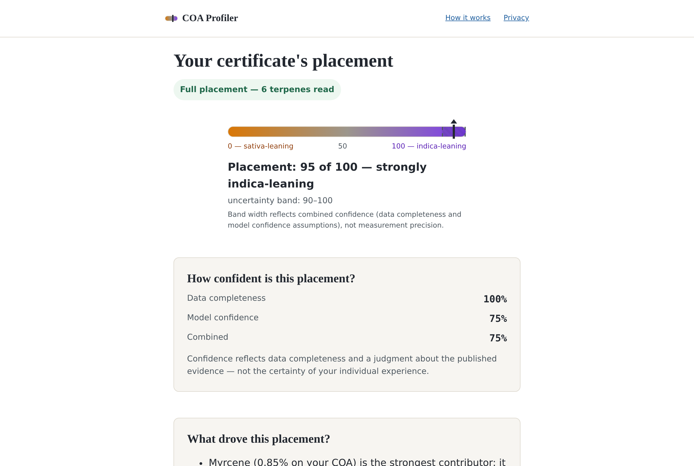
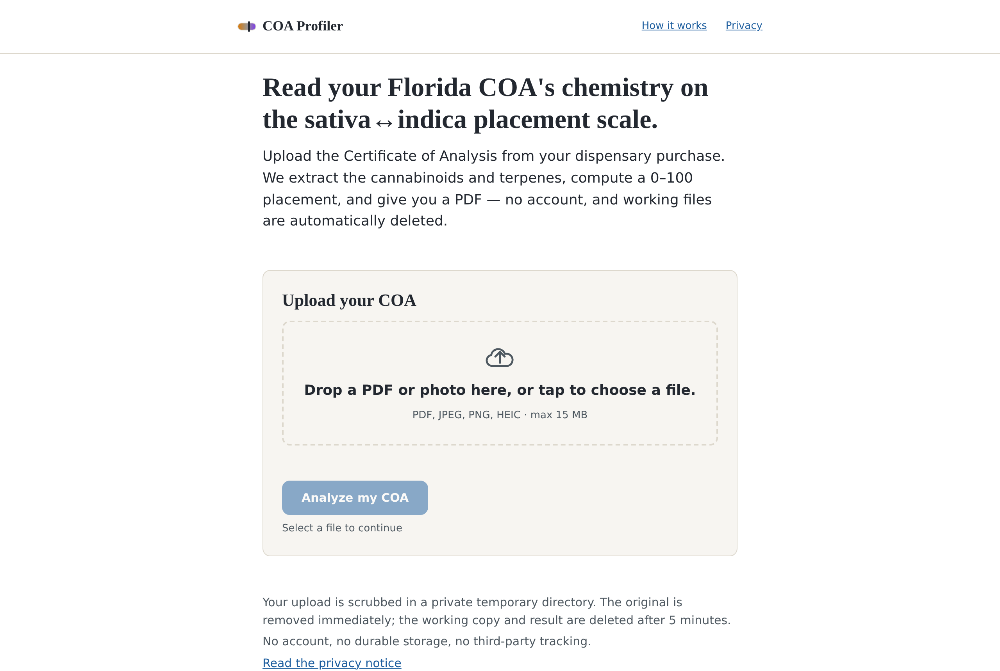

<div align="center">

# COA Effect-Spectrum Profiler

**Your cannabis lab report, finally readable.**

A free, no-account web tool that reads a Florida medical-cannabis Certificate of Analysis (a PDF or a phone photo) and places its measured chemistry on the familiar sativa ↔ indica scale. You get a plain-language rationale and a one-page PDF profile.




</div>

---

## The problem

A patient stands at the dispensary counter holding a certificate full of milligrams per gram. The shelf says *indica*, the budtender says *hybrid*, and the paper in their hand says neither in words they can use. They don't want to hand their medical documents to an app that wants an email address first.

So this tool asks for nothing. **No account and no durable storage.** The only cookie is the functional session cookie, and sessions expire after 5 minutes. EXIF and document metadata are stripped in an owner-only temp directory, the original upload is deleted at once, and the working copy goes when the session does.

<div align="center">

</div>

## What it does

1. **Upload** a Florida COA: PDF, JPEG, PNG or HEIC, up to 15 MB.
2. **Cite-and-verify extraction** of cannabinoids and terpenes, with unit normalization (`%`, `mg/g`, `mg/mL`, `ppm`), THCA/CBDA total derivation, and plausibility flags. **Anything unreadable is flagged, never estimated.**
3. **Placement** on a 0–100 scale (in steps of 5) with an uncertainty band and a two-part confidence readout: data completeness and model confidence.
4. **A one-page PDF profile**, byte-identical for identical inputs on the same build. It has no embedded timestamps, and OCR is pinned for determinism.

## What the number means, and what it doesn't

The placement is a **chemistry-derived tendency, not an effect prediction.** It's a deterministic function of the chemistry on one certificate: no strain name, dispensary label or crowdsourced rating goes in. The sativa ↔ indica taxonomy is morphological and scientifically contested. The tool uses it because it's the language patients already meet at the counter, and it says so on every result.

The weights are literature-derived hypotheses with cited sources (Russo 2011; McPartland & Russo 2001; Russo & Marcu 2017), shown publicly at `/algorithm`. Myrcene, linalool, humulene and nerolidol push toward indica; limonene, the pinenes, terpinolene and ocimene push toward sativa; THC and CBD are weak priors. β-Caryophyllene is extracted and shown but **deliberately not scored**, because giving it a direction would bias most COAs without literature support. The full function, the weight table and the reasoning are in [docs/algorithm.md](docs/algorithm.md).

## Run it

Prerequisites: Python 3.11+, Tesseract OCR, poppler-utils, libheif, and the OpenCV system libraries (`libgl1`, `libglib2.0-0`).

```bash
python -m venv .venv && source .venv/bin/activate
pip install --constraint constraints-runtime.txt -e ".[dev]"
cp .env.example .env              # set SESSION_COOKIE_SECURE=false for plain-HTTP development
uvicorn coa_profiler.app:app --reload --port 8080
```

Open **http://localhost:8080/** and upload `fixtures/fl_coa_sample.pdf`. The journey is upload → result → PDF/JSON download → *Analyze another COA*, which tears the session down.

Check a running server end to end:

```bash
python scripts/smoke_test.py --fixture fixtures/fl_coa_sample.pdf \
  --base-url http://localhost:8080 --check full
# PASS: full, score=95
```

## Tests and release gates

```bash
pytest                    # 283 passed on Python 3.12 with Tesseract installed
python -m coa_profiler.copylint --templates src/coa_profiler/web/templates/ --fixtures fixtures/
```

The suite covers unit logic, the OCR path, parser fixtures, a real-lab-text corpus, boot gates, the full HTTP journey, and an acceptance check that no payment or auth surface exists. The evaluation tests are the slow part, so `pytest -n 4` (pytest-xdist) helps.

**The bar for claiming accuracy is set higher than the tests.** Release requires an independent, held-out evaluation on de-identified real COAs with at least 20 independent ratings and an **80% concordance gate**. Generated fixtures are marked `synthetic-self-consistency`, and the gate refuses them even when they agree perfectly with the scorer. Real evaluation data stays outside the repository; `scripts/run_walkaway_gates.sh` runs all six release gates.

## Documentation

| | |
|---|---|
| [docs/SELF_HOSTING.md](docs/SELF_HOSTING.md) | install, operator tools (batch packs, evaluation, copy lint), and the hardened Nginx + Gunicorn deployment |
| [docs/algorithm.md](docs/algorithm.md) | the scoring function, weight table and citations |
| [docs/USER_GUIDE.md](docs/USER_GUIDE.md) · [docs/UI.md](docs/UI.md) | the patient journey, screen by screen |
| [docs/API.md](docs/API.md) · [docs/ARCHITECTURE.md](docs/ARCHITECTURE.md) · [docs/OPERATIONS.md](docs/OPERATIONS.md) | the public surface, the design, and running it |

Public routes: `/` · `/result` · `/result/profile.pdf` · `/privacy` · `/algorithm` · `/healthz` · `/readyz` · `/feedback`.

## How it was made

This product came out of **Sneferu's business pipeline** (run `2026-08-11T19-39-44Z-pipeline-6ca86806`). The pipeline grounded a real patient pain point, wrote a product contract, and then built, reviewed and hardened the product in cooperative rounds between independent coder and reviewer models. The honesty rules above are requirements in that contract, [spec.md](spec.md): trace every value to its source, say what the number isn't on every output, and gate release on held-out concordance.

**Runtime link to Sneferu:** none. `preview-bootstrap.js` is the hand-off record Sneferu's product launcher writes when it opens an accepted build for review. On an ordinary visit there's no record and it does nothing.

<div align="center">

---

**Built by [Sneferu](https://sneferu.ai)**

<sub>README by Claude (Anthropic). Not medical advice: the placement describes chemistry, not how any product will affect you.</sub>

</div>
