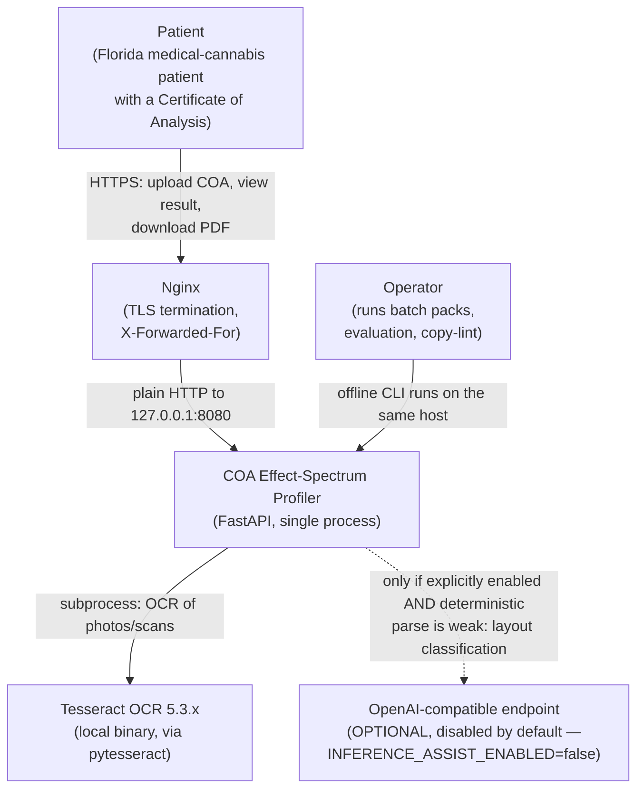
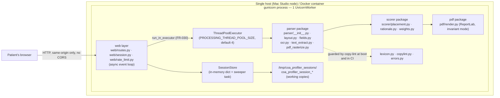
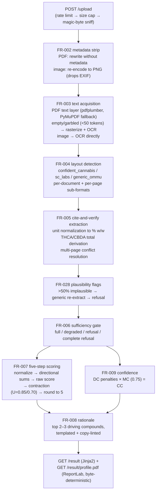
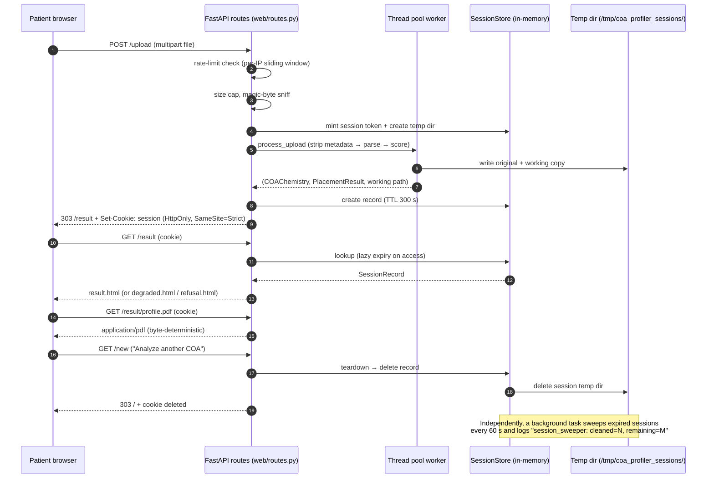
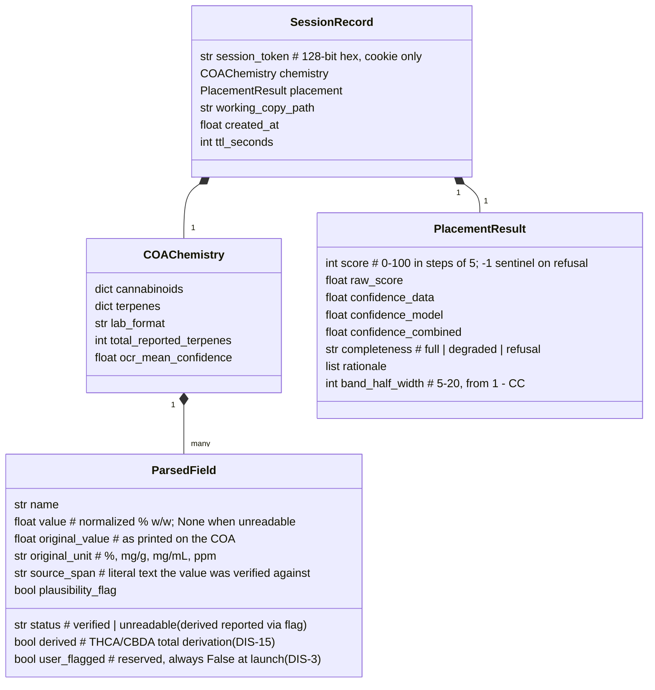

# Architecture — COA Effect-Spectrum Profiler

This document describes the system as it exists in `src/coa_profiler/`, not an
aspirational design. Every module named here exists and is linked.

## Project shape

One deployable unit with three faces:

1. **A server-rendered web application** (FastAPI + Jinja2, no frontend build
   step) — the public product.
2. **A Python library** (`parser`, `scorer`, `pdf`) — the deterministic core
   the web app and the CLIs share.
3. **Three operator-only CLIs** (`batch`, `evaluate`, `copylint`) plus two
   scripts (`scripts/smoke_test.py`, `scripts/run_walkaway_gates.sh`) — run
   offline, never exposed over HTTP.

There is **no database, no cache, no queue, no object store**. The only state
is in-memory (sessions, rate-limit counters, the feedback aggregate) and
short-lived per-session temp directories under `/tmp/coa_profiler_sessions/`.

## C4 Context

The system has exactly one optional network dependency, and it is off at
launch. Everything else is local computation.

## C4 Container

Blocking work (OCR, PDF text extraction) never touches the event loop: the
upload route hands it to a bounded thread pool with
`asyncio.wait_for(..., timeout=110s)`. A saturated pool answers 503 with
`Retry-After: 30` instead of queueing unboundedly.

## Component view — the deterministic pipeline

## Sequence — the primary user flow

## Data model

No durable entities exist. The working data structures (spec section 5) are:

The only other state is the **feedback aggregate** (in-memory counters keyed by
`(completeness, lab_format)` — no IP, no token, no chemistry) and the
**rate limiter** (per-IP sliding-window deques, reset on restart).

## Key design decisions

- **Deterministic parsing is the only active path.** Layout detection is
  signature scoring over extracted text (`parser/layout.py`); extraction is
  regex-with-citation (`parser/fields.py`) — every value must trace to a
  literal text span or it is marked `unreadable`. An optional
  OpenAI-compatible inference fallback exists (`parser/inference_assist.py`)
  behind `INFERENCE_ASSIST_ENABLED=false`; it is the only module permitted to
  make a network call, and the walk-away gates audit exactly that boundary.
- **Determinism is a feature (FR-022).** Tesseract runs with
  `OMP_THREAD_LIMIT=1` and `--psm 6` and is version-pinned in the Dockerfile;
  the PDF renderer uses ReportLab invariant mode with no timestamps, so
  identical inputs produce byte-identical PDFs (test-proven); the batch ZIP
  uses a fixed entry timestamp. The scorer version is the git tag, never a
  timestamp (DIS-12).
- **Zero retention is structural.** No database imports, no auth/payment code
  (enforced by a grep + AST gate that fails the build), sessions in memory
  with a 5-minute TTL, working copies under a prefix-swept temp root, access
  logs with hashed IPs and no cookie headers.
- **Copy is a correctness surface.** `lexicon.py` bans medical/therapeutic
  vocabulary ("treat", "dosage", "relief", …). The scan runs at boot (fatal;
  `COPYLINT_SOFT_FAIL=true` is a logged emergency override) and in CI over the
  generated rationale of every parseable fixture.
- **The weight table is code.** `scorer/weights.py` is the authoritative
  specification; `docs/algorithm.md` reproduces it and `/algorithm` renders it
  from the live module, so the public transparency page cannot drift from the
  shipped behavior.
- **Degradation is explicit, never silent.** Four sufficiency outcomes
  (full / degraded / refusal / complete refusal), an OCR confidence ladder
  (reject < 60, penalize 60–75), plausibility flags, and a >50%-implausible
  forced-refusal rule. The scorer never interpolates missing values.
- **Single worker, thread-pool offload (DIS-11, FR-030).** One gunicorn
  UvicornWorker; CPU-bound OCR/PDF work runs in a bounded
  `ThreadPoolExecutor` (default 4) with a 110 s in-route timeout below the
  120 s proxy/server timeout.

## Deployment and runtime model

- **Bare metal:** `OMP_THREAD_LIMIT=1 gunicorn coa_profiler.app:app -w 1 -k
  uvicorn.workers.UvicornWorker -b 127.0.0.1:8080 --timeout 120` behind Nginx
  (TLS, `X-Forwarded-For`, 120 s read timeout).
- **Docker:** `Dockerfile` pins the base (`python:3.11-slim-bookworm`) and
  Tesseract (`tesseract-ocr=5.3.4-1`), installs `poppler-utils`, `libheif-dev`,
  `libgl1`, `libglib2.0-0`, and runs the same gunicorn command.
  `docker-compose.yml` adds a read-only root filesystem with a `/tmp` tmpfs —
  matching the zero-retention design.
- **Boot gates (lifespan startup, `app.py`):** copy-lint (fatal) → HEIC decoder
  check (fatal when enabled) → `INFERENCE_ASSIST_ACTIVE` audit line → stale
  session-dir sweep → session sweeper task.
- **Probes:** `GET /healthz` (liveness + version), `GET /readyz`
  (`parser_ready`, `ocr_ready`, `heic_ready`, `thread_pool_available`; 503
  when any is false).
- **Packaging:** `pyproject.toml` (setuptools, `src/` layout);
  `packaging.json` declares the runtime smoke command used by the Sneferu
  product launcher.

## Where the boundaries are

| Concern | Location |
|---|---|
| HTTP surface | `src/coa_profiler/web/routes.py` |
| Sessions + sweeps | `src/coa_profiler/web/session.py` |
| Rate limiting | `src/coa_profiler/web/rate_limit.py` |
| Config / env | `src/coa_profiler/config.py` |
| Parsing pipeline | `src/coa_profiler/parser/` |
| Scoring + weights + rationale | `src/coa_profiler/scorer/` |
| PDF rendering | `src/coa_profiler/pdf/render.py` |
| Banned lexicon | `src/coa_profiler/lexicon.py` |
| Typed user errors | `src/coa_profiler/errors.py` |
| Operator CLIs | `src/coa_profiler/{batch,evaluate,copylint}.py` |
| Boot gates + app factory | `src/coa_profiler/app.py` |
