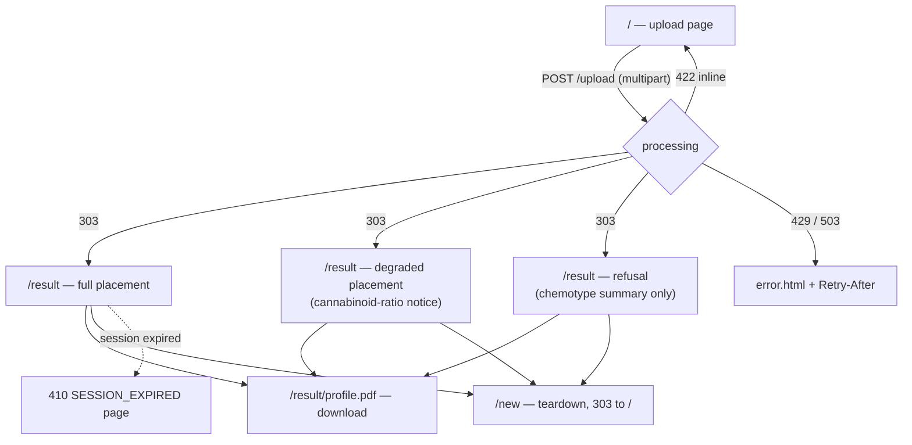

# UI — COA Effect-Spectrum Profiler

The product's UI is **server-rendered HTML** (Jinja2 templates in
`src/coa_profiler/web/templates/`) with two static assets
(`src/coa_profiler/web/static/style.css`, `spectrum.js`) and **no frontend
build step, no framework, no client-side router**. JavaScript is progressive
enhancement only: upload, results, and the PDF download work with JavaScript
disabled; drag-and-drop, the JSON download, and the feedback widget require it
(stated to the user in a `<noscript>` banner on the upload page).

The visual system — tokens, components, voice, and the forbidden
anti-patterns — is specified in [DESIGN.md](../DESIGN.md) at the repository
root (reference anchor: the GOV.UK service-page pattern). This document is the
screen inventory and flow reference.

## Local development

```bash
# .env: SESSION_COOKIE_SECURE=false (HTTP dev)
uvicorn coa_profiler.app:app --reload --port 8080
```

Templates and static files are served from the package directory; `--reload`
picks up template/CSS/JS edits. Static URLs carry a cache-busting query
(`?v=<version>`) wired from the app factory. There is no separate frontend
deploy — the UI ships inside the Python package and is served by the same
process (see [OPERATIONS.md](OPERATIONS.md)).

## Screen inventory

| Route | Template | Purpose |
|---|---|---|
| `GET /` | `upload.html` | Landing + upload: drop zone, privacy commitment, "What is a COA?" explainer, batch-inquiry contact link |
| `GET /result` | `result.html` | Full placement: spectrum bar + band, confidence, rationale, chemistry table, actions, feedback |
| `GET /result` (degraded) | `degraded.html` | Same structure plus the cannabinoid-ratio notice and degraded badge |
| `GET /result` (refusal) | `refusal.html` | No spectrum bar; refusal reason + chemotype summary of what was read |
| any typed error | `error.html` | Error page: title, message, recovery action, reference code |
| `GET /privacy` | `privacy.html` | Retention/cookie/IP-logging disclosure |
| `GET /algorithm` | `algorithm.html` | Public algorithm transparency: weight table, formulas, citations — rendered from the live `weights.py` |

Shared shell: `base.html` (header with wordmark + "How it works"/"Privacy"
links, footer brand band with the brand mark and "Free public tool" line).
Result-page partials: `_spectrum.html`, `_confidence.html`, `_chemtable.html`,
`_chemotype.html`, `_disclaimer.html`, `_actions.html`, `_freshness.html`,
`_feedback.html`.

## Primary flow



## Key components

- **Drop zone** (`upload.html` + `spectrum.js`): dashed-border label wrapping
  a visually-hidden `<input type="file">`; drag-over highlight; file-status
  line (`aria-live="polite"`); primary button disabled with visible helper
  text ("Select a file to continue") until a file is chosen. `accept` reflects
  server capability (HEIC listed only when the decoder is ready).
- **Loading overlay** (`spectrum.js`): on submit, a modal overlay
  (`role="dialog" aria-modal="true"`) with a static, honest message — no
  fake progress, no rotating captions; spinner is static under
  `prefers-reduced-motion`.
- **Spectrum figure** (`_spectrum.html` + CSS tokens): gradient track
  (sativa amber → neutral → indica violet), marker at the placement, hatched
  uncertainty band — fill + dashed edges + 45° hatch so it survives grayscale,
  color-vision deficiency, and print. Numeric placement and label are always
  text, never color alone.
- **Confidence readout** (`_confidence.html`): "Data completeness: X%. Model
  confidence: Y%. Combined: Z%." plus the note that confidence reflects data
  completeness and a judgment about the published evidence — not the
  certainty of an individual experience.
- **Chemistry table** (`_chemtable.html`): every extracted compound with the
  value as reported, the normalized value, and a status chip — *verified*,
  *derived* (with the THCA/CBDA conversion note), *unreadable* (with reason),
  ⚠ *plausibility*. A `<details>` row disclosure shows the literal source span
  the value was verified against.
- **Actions** (`_actions.html`): Download PDF profile (primary), Download raw
  data (JSON; JS-only, built client-side from the embedded `result-data`
  block), How is this calculated? (`/algorithm`), Analyze another COA (`/new`).
- **Feedback widget** (`_feedback.html`, JS-only): 👍 Helpful / 👎 Not helpful
  buttons posting to `/feedback`; an inline `role="status"` line reports
  "Submitting…" → "Thank you…" / failure. No floating toasts.
- **Freshness notice** (`_freshness.html`): the result's time-to-live; warns
  when under a minute remains.
- **Alerts** (`upload.html` inline / `error.html` page): 4px severity-colored
  left border, tinted background, title + message + recovery + reference code
  (GOV.UK error-summary pattern).

## States

- **Empty:** the upload page's resting state — helper text, disabled button.
- **Loading:** the modal overlay above; server-side processing is bounded at
  110 s.
- **Error:** inline banner for recoverable input errors (the form and page are
  preserved); dedicated error page for rate-limit/busy/scrub failures; 410
  page for expired sessions.
- **Success:** the three result variants in the inventory table.
- **No-JS:** full journey intact except drag-and-drop, JSON download, and
  feedback — disclosed in the `<noscript>` banner.

## Accessibility and resilience

Landmarks and skip link in `base.html`; native HTML controls; visible 2px
focus outlines; status communicated with hue + word + icon, never hue alone;
tables collapse to stacked cards under 640 px with `data-label` headers;
`prefers-reduced-motion` disables transitions; light theme only. Print CSS is
not shipped — the PDF profile is the print artifact.

## Static assets

| File | Role |
|---|---|
| `style.css` | All design tokens (`:root`) and component styles — no magic values elsewhere |
| `spectrum.js` | Progressive enhancement: dropzone, overlay, feedback POST, JSON download, source-span scrolling |
| `preview-bootstrap.js` | Sneferu hosted-preview handoff (no-op on direct runs) — see README |
| `favicon.svg`, `brand-mark.png` | Spectrum-bar favicon; launch-frozen brand mark in the footer band |

## Design reference

[DESIGN.md](../DESIGN.md) is authoritative for tokens, density, motion, voice,
and the six-category anti-default list. Brand direction:
[BRAND_DIRECTION.md](../BRAND_DIRECTION.md) / `BRAND_IDENTITY.json` (root).
